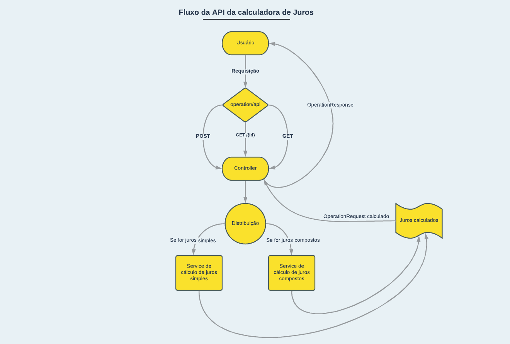
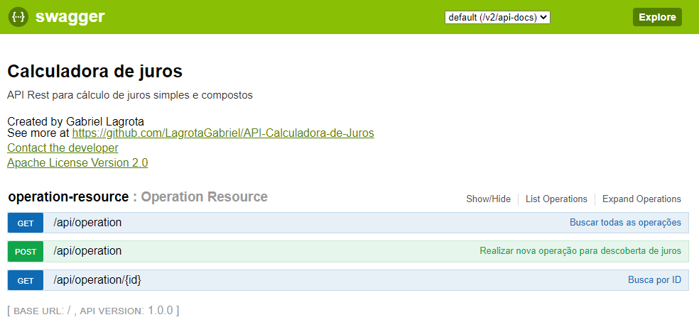
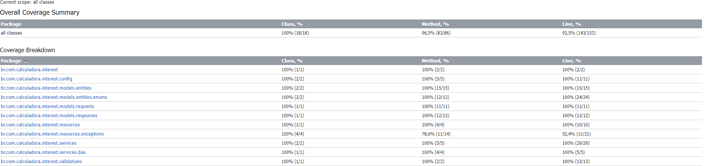

# API Calculadora de Juros
API Que realiza operações de juros simples e compostos com base no valor passado pelo usuário nas requisições via post

## Tópicos

- [Fluxo](#fluxo)
- [Funcionalidades](#funcionalidades)
- [Swagger](#swagger)
- [End Points](#end-points)
- [Testes unitários](#testes-unitários)
- [Tecnologias utilizadas](#tecnologias-utilizadas)
- [Acesso ao projeto](#acesso-ao-projeto)
- [Abrir e rodar o projeto](#abrir-e-rodar-o-projeto)
- [Desenvolvedor](#desenvolvedor)

## Fluxo

1. O usuário envia uma requisição para a API;
2. O Controller recebe a requisição;
3. O Controller irá encaminhar para o serviço de distribuição, que irá distribuir a operação matemática para o cálculo
de juros respectivo (simples ou composto);
4. O cálculo é realizado, e o resultado das operações é setado no objeto, que é devolvido para o Controller;
5. O controller por sua vez, converse o objeto para um objeto do tipo OperationResponse, que é devolvido ao usuário com
a resposta de sua operação solicitada

## Funcionalidades

:heavy_check_mark: `Cálculo de juros simples e compostos:` A API realiza o cálculo de juros simples e compostos, de acordo com a
solicitação do usuário

:heavy_check_mark: `Cálculo de montante:` A API realiza o cálculo do montante da operação passada pelo usuário por requisição via post

## Swagger

> Para acessar o swagger basta acessar o endpoint /swagger-ui.html

`Tela principal do Swagger`


## End points

> [GET] findAll: api/operation<br>
Busca por todas as operações já realizadas no banco de dados

> [GET] findById: api/operation/{id}<br>
Busca uma operação por id no banco de dados 

> [POST] create: api/operation<br>
> Cria uma nova operação no banco de dados

## Testes unitários

> Os testes unitários foram concluídos com cobertura de testes de 93% das linhas do projeto

`Relatório de cobertura de testes`


## Tecnologias Utilizadas

- Java 8
- Swagger
- MySql
- JPA
- Mockito
- Insomnia
- Spring MVC
- Lombok
- J Unit

## Abrir e rodar o projeto
1. Para rodar o projeto basta utilizar o git clone com a url:<br>https://github.com/LagrotaGabriel/API-Calculadora-de-Juros.git
2. Em seguida, recomenda-se que configure o arquivo `application.properties` com o código abaixo para configuração da persistência do projeto
   ```java 
   server.port = 8080
   spring.mvc.pathmatch.matching-strategy=ant-path-matcher
   spring.datasource.url=jdbc:mysql://localhost:3306/db?useTimezone=true&serverTimezone=UTC
   spring.datasource.username=root
   spring.datasource.password=123456
   spring.jpa.hibernate.ddl-auto=update
   spring.jpa.show-sql=true
   spring.jpa.properties.hibernate.dialect=org.hibernate.dialect.MySQL5InnoDBDialect
3. Após configurar o `application.properties`, sugiro que você crie um schema no mysql com o nome db
4. Execute o código e acesse o projeto rodando em servidor local pela url http://www.localhost:8080

## Desenvolvedor
[<br><sub>Gabriel Lagrota</sub>](https://github.com/LagrotaGabriel)